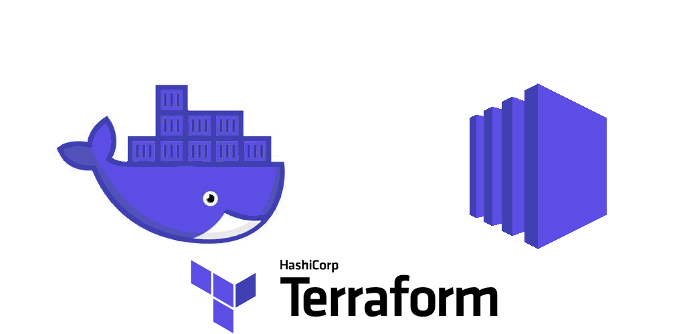

<div align="center">
  <br/>
  <a href="https://binarymist.io" title="BinaryMist">
    
  </a>
  <br/>
</div>
<br/><br/>

# Licence

This project is licensed under the `BSD 3-clause “New” or “Revised” License`. For more information please see the licence file

# Synopsis

The purpose of this project is to take advantage of the AWS free tier, specifically T2.Micro EC2 instances at this stage. The project in it's current state sets up a T2.Micro instance, along with a reasonable security profile, pushes a single docker container to the instance and runs it.

There is no reason why you couldn't setup many AWS accounts and run aws-docker-host against all of them, giving you many **free** EC2 hosts packed full of running Docker containers.

Next step is to push many containers to the same single instance, I haven't needed this yet, but probably will soon, which is pretty much just a matter of iterating on the [`aws_instance`](https://github.com/binarymist/aws-docker-host/blob/77429d31dc460e4c438fa6399975257af3eb6724/tf/instance_creation/instance.tf#L32) resource (as commented in the code).

aws-docker-host also adds or modifies an existing CloudFlare A record once your new instance is up and has its elastic IP, so that your DNS keeps pointing to the new instance each time `terraform apply` is run.

No need to store your Docker images in a registry, `terraform apply` [builds](https://github.com/binarymist/aws-docker-host/blob/77429d31dc460e4c438fa6399975257af3eb6724/tf/instance_creation/instance.tf#L44) your app or service image locally, [tars the image](https://github.com/binarymist/aws-docker-host/blob/77429d31dc460e4c438fa6399975257af3eb6724/tf/instance_creation/instance.tf#L47), [pushes image](https://github.com/binarymist/aws-docker-host/blob/77429d31dc460e4c438fa6399975257af3eb6724/tf/instance_creation/instance.tf#L61) to the new EC2 instance, [installs](https://github.com/binarymist/aws-docker-host/blob/77429d31dc460e4c438fa6399975257af3eb6724/tf/instance_creation/instance.tf#L80) the same version of Docker that you tested locally, [loads](https://github.com/binarymist/aws-docker-host/blob/77429d31dc460e4c438fa6399975257af3eb6724/tf/instance_creation/instance.tf#L89) the Docker image, [runs](https://github.com/binarymist/aws-docker-host/blob/77429d31dc460e4c438fa6399975257af3eb6724/tf/instance_creation/instance.tf#L91) the image as the container name you specify with `--restart=unless-stopped` so that you can be sure your app will always be running.

# Usage

For deployment of a docker host using Terraform. Go through this up front, then just before free tier period (one year) runs out, use the following again. Some steps can be left out if the free period has not yet run out, like there is nothing to stop you setting this infrastructure up (`terraform plan` -> `terraform apply`) and tearing it down (`terraform destroy`) repeatedly. Just keep in mind, that every time an instance is started it's classed as an instance hour, and you only get 750 hours per month per account, nothing to stop you setting up many accounts though:

Make sure [Terraform is installed](https://www.terraform.io/intro/getting-started/install.html):

1. Download the zip
2. Verify the checksum
3. Extract to a place on your path:  
  * `sudo unzip ~/Downloads/terraform_0.10.6_linux_amd64.zip -d /opt/`
  * `sudo ln -s /opt/terraform /usr/bin/terraform`

Make sure Docker is installed locally, ideally with same version that was last used to setup the infrastructure (detailed in [aws-docker-host/tf/variables_override.tf](https://github.com/binarymist/aws-docker-host/blob/77429d31dc460e4c438fa6399975257af3eb6724/tf/variables_override-example#L57) tested_docker_version).

1. Create gmail account (terraformedawsdocker<n>@gmail.com) for example  
   * Setup 2FA and Backup codes  
   
2. Create AWS account (root user) terraformedawsdocker<n>@gmail.com  
   * Use dummy info  
   
3. Create AWS IAM user terraformedawsdocker<n> from root account  
   * This account has AdministratorAccess managed policy
   * This account had cli turned on, so I could run Terraform initially, cli is not needed on this user as I now use a lower privilged user (see next step), and cli key is deactivated. When you crate this user, you can deactivate cli key  
   
4. Create AWS IAM user terraformedawsdocker<n>-cli from terraformedawsdocker<n> user above  
   * CLI access only
   * Created group `docker<n>-cli`
   * Added Policies: `AmazonEC2FullAccess` and `IAMFullAccess` (need for IAM role we add in [aws-docker-host/tf/iam/user.tf](https://github.com/binarymist/aws-docker-host/blob/aefe2eba9e953a93c248fd42f7c5be94a1c54021/tf/iam/user.tf))  

   This user runs the `terraform [ plan | apply | destroy]`. Access key id and secret access key need to be updated in aws-docker-host/tf/variables_override.tf access_key and secret_key  
   While you're there, update the cloudflare_email and cloudflare_token if they have changed (unlikely), along with any other values in the variables_override.tf file, also make sure you have generated your SSH key-pair as I explain [here](http://f1.holisticinfosecforwebdevelopers.com/chap03.html#vps-countermeasures-disable-remove-services-harden-what-is-left-ssh-hardening-ssh) in my book. Just rename the [`variables_override-example`](https://github.com/binarymist/aws-docker-host/blob/f62f757da2b2529784e1ea3f90a20cedea11a72f/tf/variables_override-example) to `variables_override.tf` add your configurations, and `chmod 600`, keep it safe and don't commit it to source control  
   
5. `terraform init` will be needed on any new development machine to load modules  
   * Then it's just a matter of `terraform plan` -> `terraform apply`, and `terraform destroy` if you want to have another go.

Check CloudFlare record to satisfy yourself that the new elastic IP has been added as the `A` record for your domain.

If this is the second time you're doing this with a new AWS account, once you have a successful deployment:

1. Upgrade Terraform to latest version
2. Upgrade Docker to latest stable version
3. Deploy again -> test

When happy, turn services off on last years AWS account, and bingo, you have another free year, with very little work.

# For ad-hoc or continuous deployment of individual containers

For example, once you have already ran `terraform apply` and your infrastructure is setup, you can very easily just run `terraform destroy` -> `terraform plan` -> `terraform apply` again, but if you have other containers running on your **free** EC2 instance, this is overkill, so I usually just do the following:

build image:

```bash
docker build --tag <image_name>
```

Test locally:

```bash
docker run -e "NODE_ENV=development" -p 80:3000 -it --name <container_name> <image_name>
```

```bash
# gives the container 10 seconds to stop it's service gracefully, if it doesn't, then it is forcefully stopped.
docker stop <container_name>
```

```bash
docker start <container_name>
```

You can deploy with a set of scripts similar to the following:

remoteWork

```bash
#!/bin/bash

# The following commands should be similar to those run in terraform.

if [ -e "$remote_tarred_image_path" ] ; then  
  echo "Stopping container: $container_name"
  echo "$(docker stop $container_name)"
  echo "Removing container: $container_name"
  echo "$(docker rm $container_name)"
  echo "Loading image from: $remote_tarred_image_path"
  echo "$(docker load -i $remote_tarred_image_path)"
  echo "Running container: $container_name from image: $image_name"
  echo "$(docker run -e \"NODE_ENV=production\" -p 80:3000 -d --restart=unless-stopped --name $container_name $image_name)"
else
  echo "The tarred image: $remote_tarred_image_path does not exist. No upgrade performed."
fi

echo "Waiting 5 seconds..."
sleep 5
echo "Currently running containers..."
echo "$(docker ps -a)"
rm $remote_tarred_image_path 2>/dev/null
```

img-deploy

```bash
#!/bin/bash

# Check aws-docker-host for settings.
# Clean out docker images from time to time on targetServer.

readonly instance_user="<user name>"
readonly docker_image_name="<your image name>"
readonly image_app_content="<where your source is>"
readonly local_tarred_docker_image_path="<source path of your tarred image>"
readonly targetServer="<address of existing elastic IP>"
readonly sshPort="<ssh port of target instance>"
readonly private_key_file_path="/home/you/.ssh/id_rsa"
readonly remote_tarred_docker_image_path="<target path of your tarred image>"
readonly docker_container_name="<what ever you want to tag your container as>"

build_and_tar_image() {
   docker build --tag $docker_image_name $image_app_content
   echo "Tarring $docker_image_name"
   docker save -o $local_tarred_docker_image_path $docker_image_name
   echo "docker save produced file: $(ls $local_tarred_docker_image_path -liah)"
}

scp_tarred_img() {
   echo
   #scp -i $private_key_file_path -qv -P $sshPort $local_tarred_docker_image_path $instance_user@$targetServer:~ 2>&1 | grep -v debug
   # Rsync gives us nice progress meter.
   echo "Rsync copying file..."
   rsync -v --progress -e "ssh -i $private_key_file_path -p $sshPort" $local_tarred_docker_image_path $instance_user@$targetServer:$remote_tarred_docker_image_path 
   declare -r result=$?
   return $result
}

remote_host_work() {
   echo
   echo "Performing remote host work now ..."
   echo
   declare -r result=$(/usr/bin/ssh $instance_user@$targetServer -p $sshPort \
      remote_tarred_image_path=$remote_tarred_docker_image_path \
      container_name=$docker_container_name \
      image_name=$docker_image_name \
      'bash -s' < "./remoteWork")
   echo "$result"
}


build_and_tar_image
scp_tarred_img
remote_host_work
```

Now just run the following once you've turned the executable bit on:

```bash
./img-deploy
```
